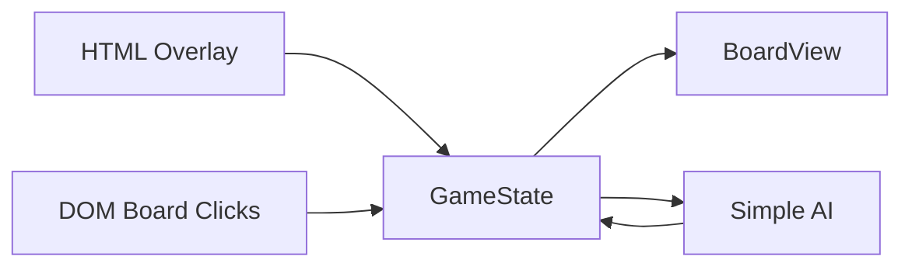

# All Queens Chess — Design

## Goals

- Faithful digital edition of ThinkFun’s *All Queens Chess* (皇后棋)
- Playable in the browser (H5) as a polished **2D** board game
- Retro, elegant presentation inspired by the official printed board
- Modes: **local two-player hotseat** and **vs simple AI**
- Pure game logic separated from rendering for clarity and testing

## Non-goals

- Online multiplayer / networking
- 3D / WebGL rendering
- Full chess engine / deep search AI

## Tech stack

| Layer        | Choice                            |
|--------------|-----------------------------------|
| Bundler      | Vite                              |
| Language     | TypeScript                        |
| Board / UI   | HTML + CSS + inline SVG queens    |
| AI           | Heuristic / shallow threat search |

## Module map

```text
src/
  main.ts                 Boot, input, AI scheduling
  game/                   Rules, moves, win, state (unchanged)
  ai/ai.ts                Threat-aware move picker
  ui/
    board.ts              5×5 DOM board, highlights, move animation
    hud.ts                Menu, turn bar, win banner
  styles/main.css         Visual system
```



## Coordinate system

- Board indices: `row` 0–4 top→bottom, `col` 0–4 left→right (matches the official setup diagram)

## Art direction (2D)

- **Concept**: medieval / early-Renaissance illuminated manuscript and woodcut, inspired by *Pentiment*
- **Background**: aged parchment washes and soft stains (no modern chrome UI)
- **Board**: ink-ruled folio frame; flat pigment tiles (bone, ash, vermillion) with hatch accents
- **Queens**: woodcut silhouettes — bold ink outlines, flat tempera fills, hatch shading, ochre coronet tips
- **HUD**: double-ruled manuscript panels, hard offset shadows, Almendra + IM Fell English + Noto Serif SC
- **Motion**: simple entrance fades; stepped (not glossy) legal-square pulse
- **Palette**: parchment, soot ink, vermillion, ochre, indigo — avoid metallic gold gradients and glassmorphism

## Interaction flow

1. Title / mode select: Local or vs AI; choose who moves first
2. Click own queen → legal targets highlighted
3. Click target → animated slide → win check → swap turn (or AI move)
4. Click empty / invalid → deselect
5. Win overlay with Play again

## AI approach

Three selectable difficulties:

- **Easy** — takes immediate wins; only ~45% chance to block opponent wins; otherwise random
- **Normal** — depth-1 search with alpha-beta; prioritizes wins, blocks, open threes
- **Hard** — depth-3 minimax with alpha-beta; stronger multi-move planning

Thinking delay scales with difficulty for clearer feedback.

## Docs & assets

- [`RULES.md`](./RULES.md) — player-facing rules (English)
- [`setup.png`](./setup.png) — official starting diagram
- This file — engineering / art decisions
