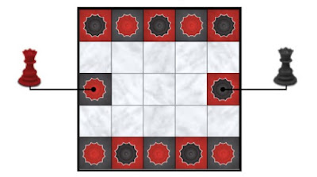

# All Queens Chess — Rules

A two-player abstract strategy game: every piece is a queen. Get four of your queens in a contiguous straight line before your opponent does.

## Components

- One 5×5 board
- Six **Red** queens
- Six **Black** queens

## Objective

Be the first player to arrange **four** of your queens in a contiguous line — horizontally, vertically, or diagonally.

## Setup

1. Place the board so both players can see all squares.
2. Place queens according to the official starting diagram:

   - **Red queens on black squares**
   - **Black queens on red squares**

3. Players decide who moves first (Red or Black). Turns then alternate.

### Starting position

Coordinates use **row 0 = top**, **column 0 = left**.

```text
     0 1 2 3 4
  0  R B R B R
  1  . . . . .
  2  R . . . B
  3  . . . . .
  4  B R B R B
```

| Side  | Starting squares                                      |
|-------|--------------------------------------------------------|
| Red   | `(0,0) (0,2) (0,4) (2,0) (4,1) (4,3)`                 |
| Black | `(0,1) (0,3) (2,4) (4,0) (4,2) (4,4)`                 |

Only the twelve start squares are tinted (black or red) and marked with a small crown. All other squares are neutral. After the game begins, colored start squares are treated as ordinary squares — any queen may land on them with a legal move.



## Turn structure

On your turn, move **exactly one** of your queens to a new square according to the movement rules below. Then it is the opponent’s turn.

## Movement

Queens move as in international chess:

- Any number of squares **horizontally**, **vertically**, or **diagonally**
- The path must be clear: you **may not jump** over another queen
- You **may not capture**: you cannot land on a square occupied by any queen (yours or the opponent’s), and you cannot push a queen off its square

## Winning

After a player completes a move, if that player has **four or more** of their queens in a contiguous straight line (horizontal, vertical, or diagonal), that player wins immediately.

## Clarifications

- There is no check, checkmate, or king.
- Blocking and crowding the board is a valid strategy; pieces never leave play.
- A line of five also wins (it contains a contiguous four).
- Draws are rare in practice; the game continues until someone forms a line of four.
